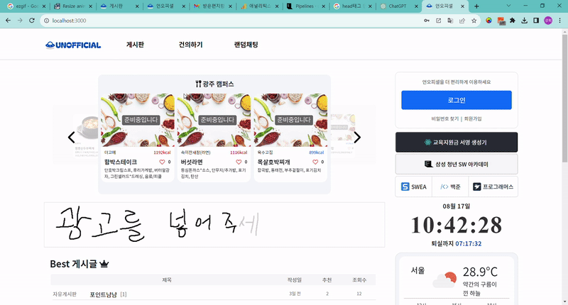
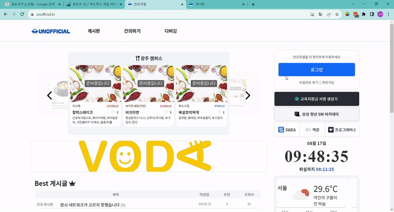
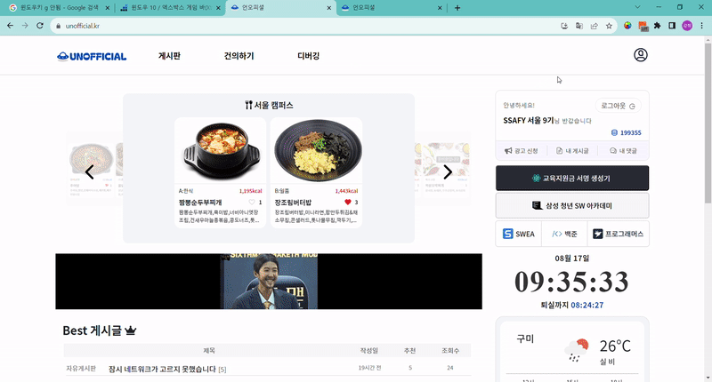
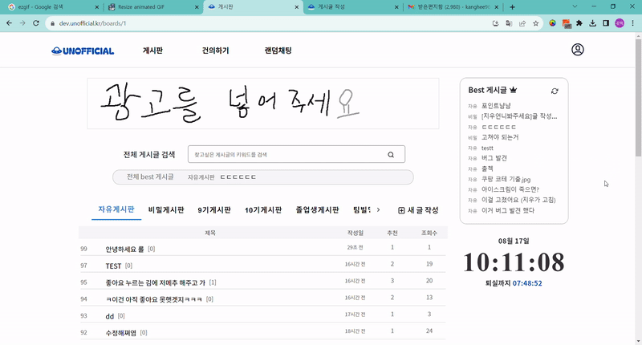
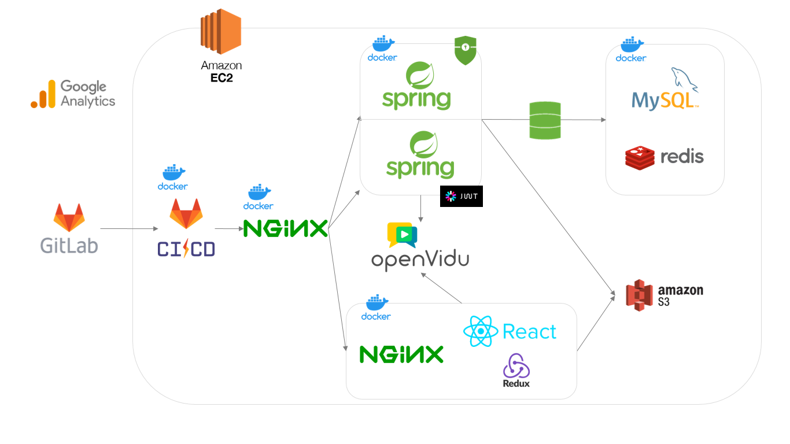
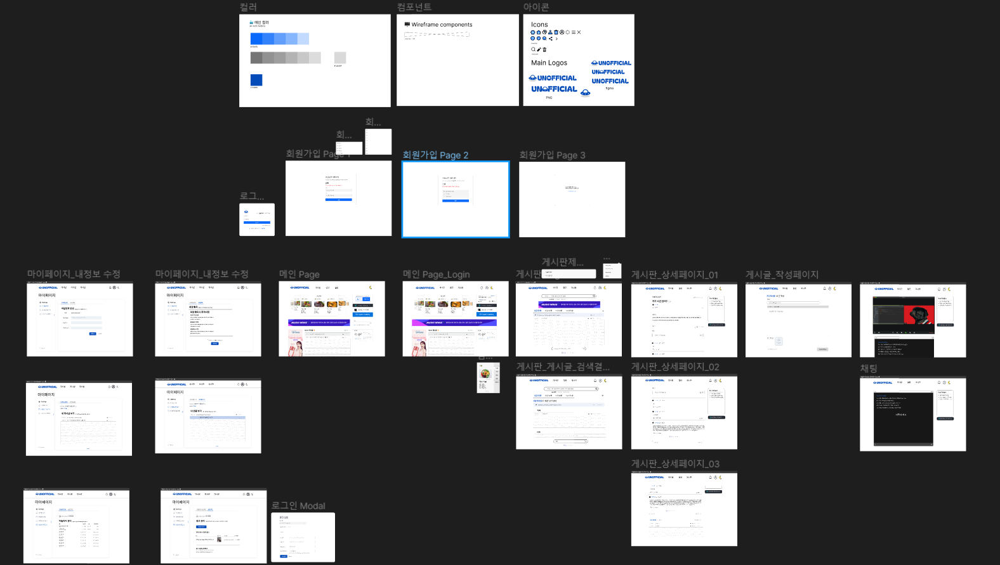
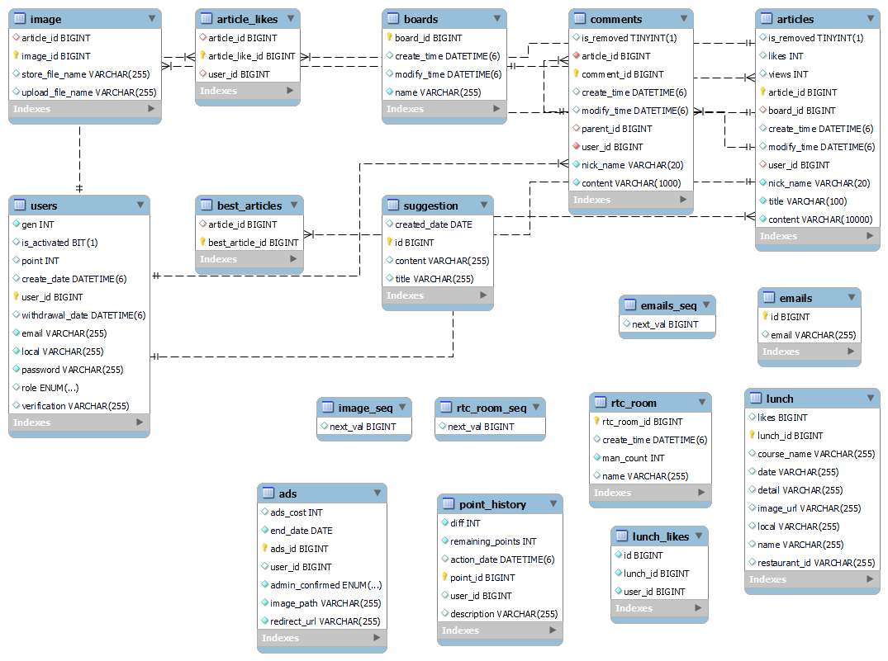
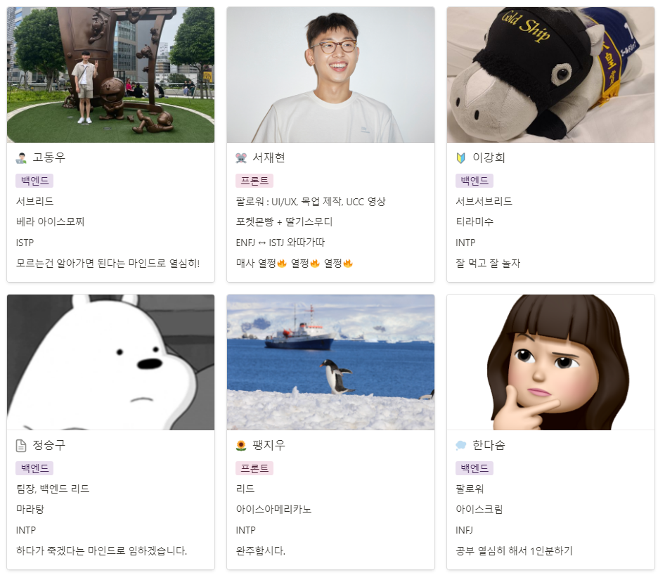

# 🚀 Unofficial: SSAFY 학생들의 진정한 커뮤니티 🚀

 

## Overview

안녕하세요, SSAFY 교육생 여러분! 힘들게 학습하고, 꿈을 키우는 여러분들을 위해 "Unofficial"이라는 특별한 공간을 준비했습니다. 이곳은 여러분만의 공간, SSAFY 출신 교육생 전용 커뮤니티입니다.

언오피셜과 함께 SSAFY 화상 커뮤니티를 시작하세요!

 

## Unofficial 서비스 화면

### 📝 회원가입 & 로그인

당신만의 아이덴티티로 Unofficial에 참여하세요. 안전하게 정보를 보호하며, 쉽고 빠르게 가입하고 로그인할 수 있습니다.

### 📹 랜덤 채팅

온라인에서도 친구들과 소통하세요. 멀리 있어도 마치 옆에 있는 것처럼!

### 👤 마이페이지

개인화된 정보와 설정, 여러분의 활동 내역을 한 눈에 확인하실 수 있습니다. 나만의 공간을 꾸미고, SSAFY 생활의 흔적을 남기세요.

### 🍱 점심 메뉴 확인

오늘의 점심은 무엇일까요? 매일 업데이트되는 점심 메뉴를 통해 미리 선택하고 기대해보세요!

### 🎉 개인 광고 게시

자신만의 소식, 홍보하고 싶은 것들을 공유하세요! 여러분의 소식을 기다립니다.

### 📝 익명 게시판 & 댓글

여러분의 이야기, 정보, 질문을 자유롭게 나누세요. 함께 성장하는 커뮤니티가 될 것입니다.

 

## 주요 기능

### 프로젝트 기능

- 화상 랜덤 채팅 서비스
  - WebRTC 기술을 활용해, 상대방의 얼굴을 직접 볼 수 있는 실시간 채팅을 즐기세요. 진정한 대화의 즐거움을 경험해보세요.  
- 마일리지로의 개인 광고 서비스
  - 활발한 토론과 게시글 작성으로 마일리지를 획득하고, 그 마일리지로 Unofficial 메인페이지에서 자신만의 광고를 선보이세요.  
- 익명의 자유로운 게시판
  - 익명성을 보장하여, SSAFY 교육생들과 솔직하면서도 즐거운 이야기를 나눠보세요. 더욱 풍부한 소통의 공간입니다.

### 개발환경

- OS
  - Local : Windows
  - AWS : Ubuntu
- IDE
  - IntelliJ IDE
  - Visual Studio Code
- UI / UX
  - Figma
- DataBase
  - MySQL workbench
  - MySQL
  - Redis
- CI/CD
  - Docker
  - nginx
  - GitLab CI/CD

### 상세 스택

- BackEnd
  - JAVA 17
  - Gradle
  - SpringBoot 3.1.1, Quarydsl-JPA 5.0.0, Lombok, Swagger3, CertBot
- FrontEnd
  - HTML5, CSS3, JavaScript(ES6)
  - React 18.2.0, React-redux 8.1.1, React-router-dom 6.14.1
  - axios 1.4.0, Material-UI, bootstrap 5.3.0
  - Node.js , npm, env-cmd 10.1.0
  - Web RTC, openvidu-browser
- ETC
  - nginx 1.25.1
  - redix:latest
  - docker

### 협업 툴

- 이슈 관리 : Jira
- 형상 관리 : Gitlab, Git
- 커뮤니케이션 : Notion, MatterMost

### 서비스 아키텍처

### 요구 사항 정의서

### 화면 설계서

### Git 컨벤션

- feat : 새로운 기능 추가 (넓은 개념)
- fix : 버그 수정
- design : css 등 UI 디자인 변경
- add : 코드, 테스트, 예제, 문서 등 추가 생성 (좁은 개념)
- delete : 코드 삭제
- rename : 이름 변경, 위치 옮기는 작업
- refactor : 코드 전면 수정
- test : 테스트 코드 추가, 테스트 코드 리팩토링

### ERD

### EC2 포트 정리

| 포트 | 내용 |
| ---- | -------------------- |
| 80   | nginx HTTP 기본 포트  |
| 443  | nginx HTTPS          |

### 팀원 역할

